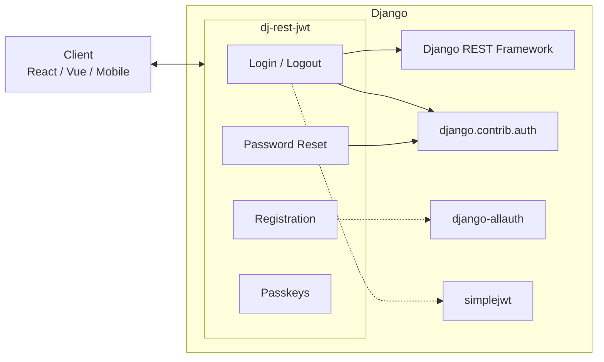

# dj-rest-jwt

[](https://github.com/iMerica/dj-rest-jwt/actions/workflows/main.yml)
[](https://github.com/iMerica/dj-rest-jwt/actions/workflows/security.yaml)
[](https://pypi.org/project/dj-rest-jwt/)
[](https://pypi.org/project/dj-rest-jwt/)
[](https://pypi.org/project/dj-rest-jwt/)

Secure drop-in authentication endpoints for Django REST Framework. Works seamlessly with SPAs and mobile apps.

**[Documentation](https://dj-rest-jwt.readthedocs.io/)** | **[PyPI](https://pypi.org/project/dj-rest-jwt/)**

## Features

- Login, logout, password change, password reset
- User registration with email verification
- Built-in MFA/2FA support (TOTP + recovery codes)
- Passkey / WebAuthn passwordless authentication
- JWT authentication with HTTP-only cookies
- Social auth (Google, GitHub, Facebook) via django-allauth
- Fully customizable serializers

## Architecture



## Quick Start

```bash
pip install dj-rest-jwt
```

```python
# settings.py
INSTALLED_APPS = [
    ...
    'rest_framework',
    'rest_framework.authtoken',
    'dj_rest_jwt',
]
```

```python
# urls.py
urlpatterns = [
    path('auth/', include('dj_rest_jwt.urls')),
]
```

You now have:

| Endpoint | Method | Description |
|----------|--------|-------------|
| `/auth/login/` | POST | Obtain auth token |
| `/auth/logout/` | POST | Revoke token |
| `/auth/user/` | GET, PUT | User details |
| `/auth/password/change/` | POST | Change password |
| `/auth/password/reset/` | POST | Request reset email |
| `/auth/password/reset/confirm/` | POST | Confirm reset |

## JWT with HTTP-only Cookies

```bash
pip install dj-rest-jwt djangorestframework-simplejwt
```

```python
# settings.py
REST_FRAMEWORK = {
    'DEFAULT_AUTHENTICATION_CLASSES': [
        'dj_rest_jwt.jwt_auth.JWTCookieAuthentication',
    ],
}

REST_AUTH = {
    'USE_JWT': True,
    'JWT_AUTH_COOKIE': 'access',
    'JWT_AUTH_REFRESH_COOKIE': 'refresh',
    'JWT_AUTH_HTTPONLY': True,
}
```

## Registration

```bash
pip install 'dj-rest-jwt[with-social]'
```

```python
# settings.py
INSTALLED_APPS = [
    ...
    'django.contrib.sites',
    'allauth',
    'allauth.account',
    'dj_rest_jwt.registration',
]

SITE_ID = 1
```

```python
# urls.py
urlpatterns = [
    path('auth/', include('dj_rest_jwt.urls')),
    path('auth/registration/', include('dj_rest_jwt.registration.urls')),
]
```

## MFA / 2FA

```bash
pip install 'dj-rest-jwt[with-mfa]'
```

MFA ships as an opt-in sub-package (`dj_rest_jwt.mfa`) with:

- TOTP login challenge flow
- Recovery codes
- Security-focused defaults (short-lived MFA tokens, activation confirmation)

See the guide for setup and endpoint details:
[MFA Guide](https://dj-rest-jwt.readthedocs.io/en/latest/guides/mfa/)

## Passkeys (WebAuthn)

```bash
pip install 'dj-rest-jwt[with-passkeys]'
```

Passkeys provide passwordless authentication using the FIDO2/WebAuthn standard:

- Touch ID, Windows Hello, hardware security keys
- Two-step challenge-response registration and login
- Credential management (list, rename, delete)

See the guide for setup and endpoint details:
[Passkeys Guide](https://dj-rest-jwt.readthedocs.io/en/latest/guides/passkeys/)

## Documentation

Full documentation at **[dj-rest-jwt.readthedocs.io](https://dj-rest-jwt.readthedocs.io/)**

- [Installation & Configuration](https://dj-rest-jwt.readthedocs.io/en/latest/getting-started/installation/)
- [API Endpoints](https://dj-rest-jwt.readthedocs.io/en/latest/api/endpoints/)
- [JWT & Cookies Guide](https://dj-rest-jwt.readthedocs.io/en/latest/guides/jwt-cookies/)
- [Social Authentication](https://dj-rest-jwt.readthedocs.io/en/latest/guides/social-auth/)
- [MFA Guide](https://dj-rest-jwt.readthedocs.io/en/latest/guides/mfa/)
- [Passkeys Guide](https://dj-rest-jwt.readthedocs.io/en/latest/guides/passkeys/)

## Contributing

```bash
pip install -r dj_rest_jwt/tests/requirements.txt
python runtests.py
```

See [Contributing Guide](https://dj-rest-jwt.readthedocs.io/en/latest/contributing/) for details.

## License

MIT
